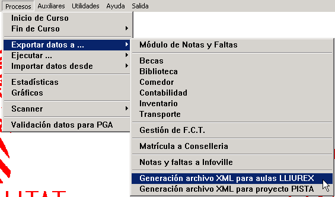
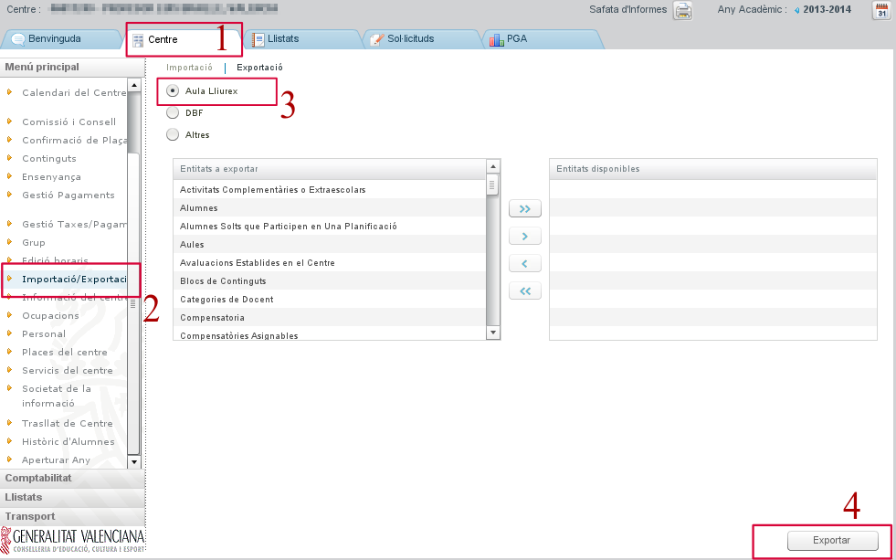
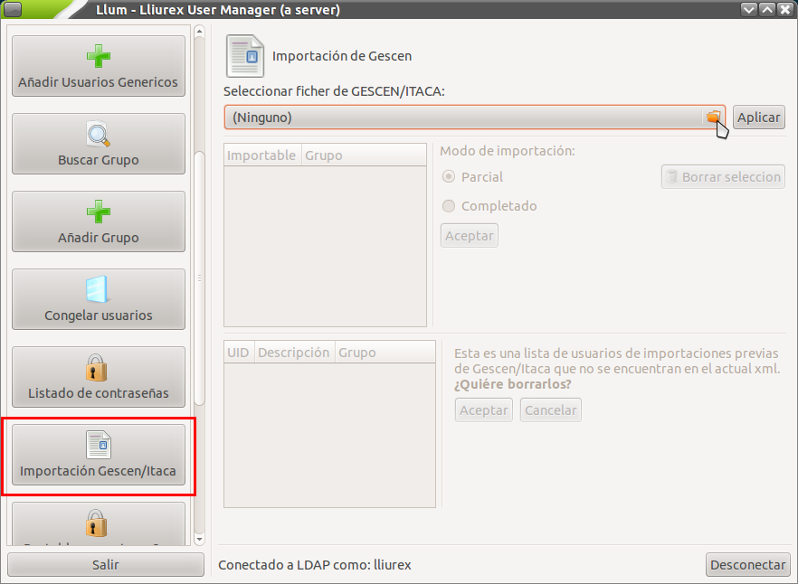

Importación de usuarios y grupos
================================

Para el mejor aprovechamiento de la funcionalidad de un servidor LliureX es importante configurar el conjunto de usuarios y grupos. Un sistema de gestión de usuarios y grupos permite aplicar diferentes niveles de privilegios según el usuario concreto o grupo al que pertenece. En LliureX se ha desarrollado una herramienta denominada **Llum** (*LliureX User Manager*). Con *Llum* se pueden dar altas, bajas y modificaciones de usuarios y grupos.

La opción más lógica para comenzar la configuración de usuarios y grupos en LliureX es realizar una *importación de usuarios y grupos*. En los centros docentes contamos con la posibilidad de generar un archivo con toda la información necesaria a partir del programa de Gestión de Centros (GESCEN) o de ITACA. El proceso es el siguiente:

# Generación del archivo con los datos de alumnos, grupos y profesores (en formato XML)
# Importación del archivo generado con el gestor de usuarios **Llum**.

De esta manera nos ahorraremos una gran cantidad de tiempo en la creación de usuarios y grupos del sistema. Veamos con más detalle cómo realizar este proceso de importación de usuarios.

Generación del archivo de usuarios y grupos
-------------------------------------------

A partir de GESCEN
^^^^^^^^^^^^^^^^^^

El primer paso es iniciar la aplicación GESCEN y hacer clic en el menú **Procesos**, a continuación **Exportar datos a...**, y hacer clic en **Generación archivo XML para aulas LliureX**.

A continuación, se abrirá una ventana de confirmación del proceso; haga clic en **Sí** para generar el archivo. Una vez finalizada la generación del archivo, se abrirá una ventana con un aviso que muestra el resultado de la exportación y la carpeta donde ha generado el fichero **llxgesc.xml**. Guarde el fichero en un dispositivo de almacenamiento con capacidad suficiente (por ejemplo en una memoria USB).

A partir de ITACA
^^^^^^^^^^^^^^^^^

De la misma manera que con GESCEN, inicie la aplicación de ITACA, vaya a la pestaña de **Centro** (1) y en el menú de la izquierda escoja la entrada **Importación/Exportación** (2). En la parte central deje seleccionada la opción **Aula LliureX** (3) y, finalmente, pulse el botón **Exportar** (4) que le pregunta dónde quiere guardar el fichero **llxgesc.xml**. Escoja la carpeta y pulse el botón "Aceptar".

Importación de usuarios y grupos a partir del archivo
-----------------------------------------------------

Para importar la información de usuarios y grupos, acceda a *Aplicaciones* > *Administración de LliureX* > *Centro de control de LliureX* y en la sección *Sistema* acceda a la herramienta *Gestión de usuarios de LDAP* (que corresponde a Llum). Para realizar este tipo de operación es necesario utilizar un usuario y contraseña con permisos de administración. Puede utilizar el usuario **netadmin** que acaba de crear en la inicialización del servidor. Una vez dentro escoja el botón *Importación Gescen/Itaca* del listado de la izquierda (utilice la barra de desplazamiento vertical si es necesario). En la parte central de la ventana le aparecerá la opción desplegable para escoger el archivo de su sistema de archivos.

Una vez escogido el archivo **llxgesc.xml** pulse sobre el botón *Aplicar*. Dependiendo del número de usuarios de su centro, el proceso será más o menos costoso. ¡Tenga paciencia!

Durante el desarrollo de la importación de usuarios se irán creando secuencialmente cada uno de los usuarios (nombre de usuario, contraseña, directorio de inicio y permisos en el servidor) así como los grupos definidos en GESCEN o ITACA en el momento de realizar la exportación del fichero. Una vez finalizada la importación de usuarios podrá comprobar los grupos generados con la opción de *Listado de contraseñas* (justo antes de *Importación Gescen/Itaca*).
