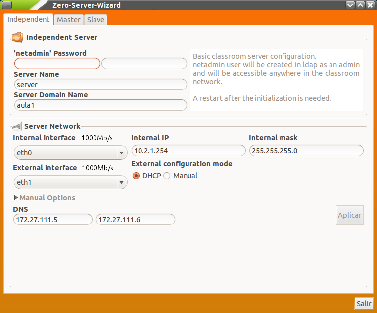

Configuración inicial
=====================

Al arrancar la máquina con el nuevo sistema, en primer lugar se muestra una ventana para el inicio de sesión de usuario. Introduzca el nombre de usuario y contraseña del usuario (los que haya especificado durante la instalación).

.. note::
  Le recordamos que es muy recomendable realizar una actualización del servidor antes de comenzar la configuración inicial del mismo.

El servidor Lliurex 13.06 incluye un asistente llamado *Zero Server Wizard* que permite realizar todo el proceso de configuración de manera automática y en cómodos pasos. Para acceder a esta herramienta de configuración automática vaya al menú *Aplicaciones* -> *Administración de LliureX* -> *Centro de Control LliureX*. Una vez dentro del *Centro de Control de LliureX* acceda a la pestaña *Sistema* y ejecute *Zero Server Wizard*. Se abrirá una ventana con las siguientes opciones marcadas por defecto:

En la nueva versión de LliureX se ha añadido el usuario **netadmin** para la administración global. Este usuario se genera al inicializar el servidor con el asistente (*zero-server-wizard*) y lo podremos utilizar para entrar en cualquier equipo de la red (ya que se da de alta en LDAP y tiene permisos de administración).

.. note::
  Hay que diferenciar el usuario **netadmin** del usuario que creamos al instalar el servidor (que será administrado local y no podrá entrar en el resto de equipos de la red).

